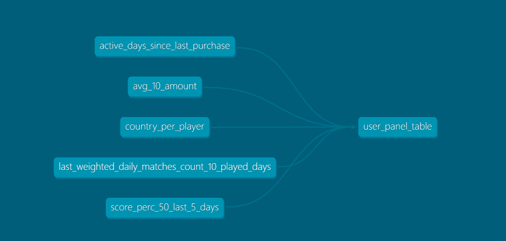

# Play Perfect - user_panel 

## Project Descrition:
### This project include 2 parts:
1. **Pipeline**: 
    a. dbt modeling data, described in 
    b. data loading  python script:  load user_panel table to indexed Postgresql table (deployed on GCP) for efficient fetching 
2. **Api-Service**: Web api Expose GetAttribute by player Id, using FastApi web framework and psycopg2 to interact with Postgresql

